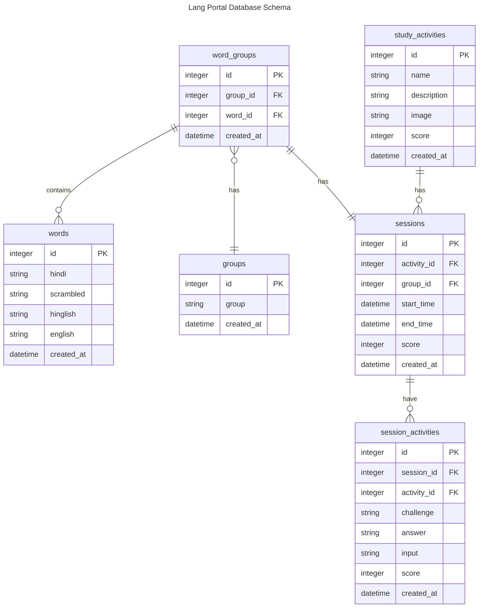

# Backend for the Lang Portal Project
A hindi language learning school wants to build a sample project that could help the users learn appropriate language.
The portal in its current form, will do the following:
- Act as a launchpad for different study activities.
- Store Language words and sentences, that would aid in learning activities. 
- Act as a record keeping app for tracking progress and performance.

## Technical Requirements
- Backend will be wriiten using Go, with standard libraries.
- The database used will be SQLite3. 
- The API request and response will be in JSON format.
- The API will be stateless, and will not store any persistent data.
- The API will not be versioned. 

## Database Design

table: words
columns: 
   - id: integer
   - hindi: string 
   - scrambled: string
   - hinglish: string
   - english: string
   - created_at: datetime

table: groups
columns: 
   - id: integer
   - group: string
   - created_at: datetime

table: word_groups
columns: 
   - id: integer
   - group_id: integer
   - word_id: integer
   - created_at: datetime

table: study_activities
columns: 
   - id: integer
   - name: string 
   - description: string
   - image: string
   - score: integer
   - created_at: datetime

table: sessions
columns: 
   - id: integer
   - activity_id: integer
   - group_id: integer
   - start_time: datetime
   - end_time: datetime
   - score: integer
   - created_at: datetime

table: session_activities
columns:
   - id: integer
   - session_id: integer
   - activity_id: integer
   - challenge: string
   - answer: string
   - input: string
   - score: integer
   - created_at: datetime

## ER Diagram

## API Design

[GET]
- /api/words
- /api/words/:id

- /api/groups
- /api/groups/:id

- /api/words/groups/:group-id  -- joins words and groups tables based on word_groups table and filters by group_id

- /api/study-activities -- lists all available study activities
- /api/sessions -- lists all sessions so far
- /api/sessions/:id -- lists session details including its study activities

[POST]
- /api/sessions
- /api/session-activity

[PUT]
- /api/sessions
- /api/session-activity