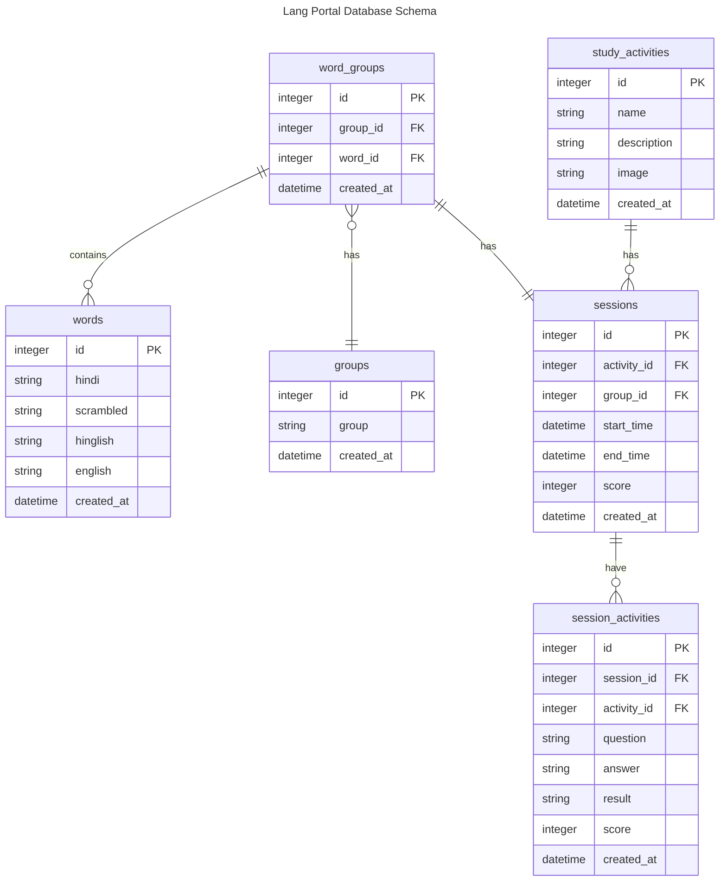

# Backend for the Lang Portal Project
A hindi language learning school wants to build a sample project that could help the users learn appropriate language.
The portal in its current form, will do the following:
- Act as a launchpad for different study activities.
- Store Language words and sentences, that would aid in learning activities. 
- Act as a record keeping app for tracking progress and performance.

## Technical Requirements
- Backend will be wriiten using Go, with Echo framwork.
- The database used will be SQLite3. 
- The API request and response will be in JSON format.
- The API will be stateless, and will not store any persistent data.

- The data will be stored in a SQLite3 database.
- The database will be hosted on the same machine as the API.
- If the database does not exist, it will be created using schema.sql.
- The data will be seeded if the data is not present.

## Database Design

table: words
columns: 
   - id: integer
   - hindi: string 
   - scrambled: string
   - hinglish: string
   - english: string
   - created_at: datetime

table: groups
columns: 
   - id: integer
   - group: string
   - created_at: datetime

table: word_groups
columns: 
   - id: integer
   - group_id: integer
   - word_id: integer
   - created_at: datetime

table: study_activities
columns: 
   - id: integer
   - name: string 
   - description: string
   - image: string
   - created_at: datetime

table: sessions
columns: 
   - id: integer
   - activity_id: integer
   - group_id: integer
   - start_time: datetime
   - end_time: datetime
   - score: integer
   - created_at: datetime

table: session_activities
columns:
   - id: integer
   - session_id: integer
   - activity_id: integer
   - question: string
   - answer: string
   - result: string
   - score: integer
   - created_at: datetime

## ER Diagram

## API Design
- The endpoints follow JSON format.
- The API is stateless, and does not store any persistent data.
- The API is not intended to be used by end users.
- The API does not have any authentication or authorization.
- The APIs should be paginated.
- The application is not multi-user, and is not intended to be scaled.

API Endpoints to be implemented:
- [GET] /api/words - get all words
- [GET] /api/words/random - get a random word
- [GET] /api/groups - get all groups
- [GET] /api/groups/:id/words - get all words from a group
- [GET] /api/groups/:id/words/random - get random words from a group
- [GET] /api/study-activities - get all study activities
- [GET] /api/sessions - get all sessions details
- [GET] /api/sessions/:id - get a single session details
- [GET] /api/sessions/:id/activity - get session activity details

- [POST] /api/sessions - start or create a new session
- [POST] /api/sessions/:id/activity - add activity to a session

- [PUT] /api/sessions - update session details

- [DELETE] /api/reset - clear all sessions and related data
